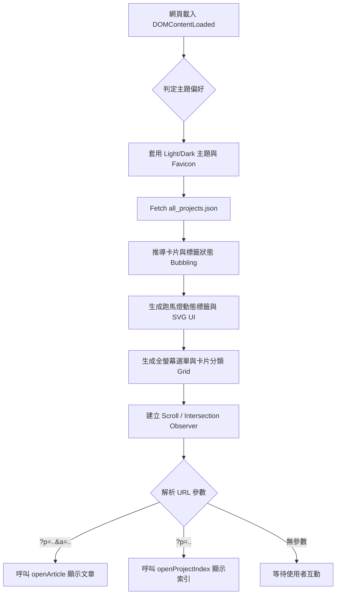

# 📦 風川梓 (Azustock) 作品集與技術部落格 - 交接與維護指南 (v0.5.6 更新版)

> **閱讀對象**：本指南專為「從未接觸過此專案」的開發人員撰寫，旨在幫助您從整體架構到程式碼細節，快速掌握專案全貌並具備獨立維護能力。

## 1. 專案概述

### 1.1 專案用途

本專案為一個個人技術部落格與作品集展示網站。提供專案分類展示、標籤過濾（動態跑馬燈與卡片高亮）、以及無縫的單頁應用（SPA）Markdown 文章閱讀體驗，並**內建專業級 Mermaid 架構圖互動引擎**。

### 1.2 系統架構

本專案採用 **純前端 (Vanilla Frontend) 架構**，不依賴後端伺服器與前端框架（如 React/Vue）。

* **核心技術**：HTML5 + CSS3 (大量使用 CSS 變數、全域屬性選擇器與 `-webkit-mask-image` 遮罩技術) + Vanilla JavaScript (ES6+)。
* **資料庫與自動化**：透過 Python 腳本 (`generate_projects.py`) 掃描本地 Markdown 與圖片，自動轉檔並打包為 `all_projects.json` 靜態資料庫。
* **Markdown 與圖表渲染**：引入第三方 `marked.js` 解析 Markdown，並動態載入 `Mermaid.js` (ESM 模組) 即時渲染架構圖。

### 1.3 執行流程

1. 使用者載入網頁，瀏覽器解析 HTML 與 CSS。
2. JS 啟動，判定使用者主題偏好（深色/淺色）並套用，同步初始化 Mermaid 引擎主題。
3. 發起非同步請求 (Fetch) 獲取 `all_projects.json`。
4. JS 根據 JSON 資料，動態生成全螢幕導覽列、跑馬燈標籤、以及專案卡片網格。
5. 監聽 URL 參數，支援專案層級 (`?p=`) 與文章層級 (`?p=&a=`) 的路由，自動打開對應的索引或文章。

### 1.4 各模組之間的關係

* **`index.html` (骨架)**：定義了全站的基本 DOM 結構與 CDN 資源引入。
* **`style.css` (外觀與物理引擎)**：處理了全站 80% 的互動動畫（如 FLIP 動畫、Hover SVG 書本開合特效、骨架屏），並統一管理全域 Markdown 圖片排版系統。
* **`main.js` (大腦)**：負責抓取資料、注入 DOM、URL 路由管理、`marked.js` 攔截器，以及 Mermaid 架構圖的互動控制 (縮放、平移、全螢幕)。
* **`generate_projects.py` (心臟)**：負責在發布前清理資料、轉換 WebP、智慧替換 Markdown 圖片路徑，並執行多層級排序。

---

## 2. 專案目錄說明

| 檔案/資料夾名稱 | 檔案用途 | 核心模組 | 相依哪些模組 | 被哪些模組使用 |
| --- | --- | --- | --- | --- |
| `index.html` | 網站進入點，定義 DOM 容器結構 | 是 | `style.css`, `main.js` | 無 (為最頂層) |
| `style.css` | 網站視覺樣式與 CSS 動畫引擎 | 是 | 無 | `index.html`, `main.js` |
| `main.js` | 核心邏輯、資料載入、DOM 動態生成 | 是 | `all_projects.json`, `marked.js`, `mermaid.js` | `index.html` |
| `generate_projects.py` | 本地端打包腳本，生成 JSON 資料庫 | 是 | 系統檔案模組, Regex | 開發者部署時執行 |
| `all_projects.json` | 存放專案與文章內容的資料庫檔案 | 是 | 無 | `main.js` |
| `projects/` | 原始文章結構庫 (Markdown 與圖片) | 否 | 無 | `generate_projects.py` |

---

## 3. 各檔案詳細說明

### 📄 `style.css`

* **主題系統**：定義在 `[data-theme="dark"]` 與 `[data-theme="light"]`。
* **全域 Markdown 圖片系統**：利用 `[alt="float-right"]`、`[alt="center"]` 等屬性選擇器，無需寫 HTML 即可實現全域圖文排版與骨架屏防塌陷。
* **SVG 遮罩與動畫**：
* **純 CSS 互動**：利用 `:has()` 選擇器與 SVG 堆疊，達成例如「滑過卡片時書本打開」等高階互動。
* **Mask Image**：針對偽元素 `::after` (如捲動提示箭頭)，使用 `-webkit-mask-image` 配合 `background-color`，使 SVG 圖示能完美跟隨主題變色。

### 📄 `main.js`

* **動態 ESM 載入**：在檔案最上方動態 `import()` Mermaid 核心引擎，避免阻塞首頁渲染。
* **`marked.js` 攔截器 (Renderer)**：
* **圖片攔截 (`renderer.image`)**：相容最新版傳入 Object Token 的機制，強制為所有圖片掛上 `is-loading` 骨架與破圖防護 (`onerror`)。
* **代碼攔截 (`renderer.code`)**：攔截 `mermaid` 語言，將其封裝進帶有放大縮小、全螢幕與拖曳功能的互動控制台 DOM 中。

* **路由守門員**：透過 `URLSearchParams` 判斷是否有 `p` 與 `a` 參數，並利用 `setTimeout(..., 300)` 確保 DOM 生成後再執行跳轉。

### 📄 `generate_projects.py`

* **智慧路徑替換引擎**：透過 Regular Expression 準確辨識 Markdown 語法 (``) 與 HTML (``)，並加入防呆機制（避免 `projects/` 路徑重複疊加）。
* **多層次權重排序**：利用 Python 的 Tuple 比較機制 `(分類排名, 置頂優先, sort_order 編號, folder_name 字母)`，確保輸出的 JSON 完全符合期望的展示順序。

---

## 4. 核心函式索引 (`main.js`)

| 函式名稱 | 核心功能 | 被誰呼叫 |
| --- | --- | --- |
| `applyTheme` | 切換深淺色、Favicon 與 Mermaid 渲染主題 | `DOMContentLoaded`, 主題切換按鈕 |
| `handleImageError` | 破圖處理 (換成 1x1 透明 GIF 解鎖背景權限) | 圖片的 `onerror` 屬性 |
| `switchModalContent` | 執行 Modal 內容替換與 FLIP 平滑高度過渡 | `openProjectIndex`, `openArticle` |
| `openProjectIndex` | 開啟專案文章目錄 Modal | 點擊卡片、點擊「返回索引」按鈕、URL 路由 |
| `openArticle` | 渲染 Markdown 內文並加上複製按鈕與 Mermaid | `openProjectIndex` 內的連結、URL 路由 |
| `zoomMermaid` | 控制 Mermaid 圖表的縮放比例，並鎖定外框高度 | Markdown 內的圖表控制台按鈕 |
| `fullscreenMermaid` | 觸發瀏覽器全螢幕 API，並記憶捲軸位置 | Markdown 內的圖表控制台按鈕 |
| `initMermaidDrag` | 綁定滑鼠拖拽事件，實現畫布平移 (Panning) | `openArticle` (Mermaid 渲染完畢後) |
| `filterByTag` | 過濾卡片並讓跑馬燈平滑對齊 | 點擊卡片標籤或跑馬燈標籤 |

---

## 5. 執行流程 (系統生命週期)

---

## 6. 已知問題與容易踩雷的地方

* **`marked.js` 版本升級陷阱**：新版 `marked.js` 的 `renderer` 會傳入單一 `Token Object` 而非多個 `String` 參數。`main.js` 中已實作兼容判斷 `typeof token_or_href === 'object'`，未來升級套件時需特別留意 API 變更。
* **偽元素與 SVG**：CSS 的 `::after` 或 `::before` 內容無法直接填入 HTML `<svg>` 標籤。如果需要動態變色的圖示，**絕對不能用 `content: url(...)**`，必須使用 `-webkit-mask-image` 配合背景色實現。
* **Mermaid 的 DOM 依賴**：Mermaid 渲染必須在元素「真實存在於畫面上且具有寬高」時才會準確。這也是為什麼我們在全螢幕退出時，需要 `setTimeout` 50ms 等待瀏覽器排版完成後，才能準確還原捲軸位置。
* **SPA 捲軸記憶**：當從文章切換回內容索引時，會使用 `window.lastIndexScrollPos` 來精準還原捲動高度。但前提是外層的 `switchModalContent` 必須確實「鎖定」DOM 容器高度，否則還原會失敗。

---

## 7. 維護建議

* **如何新增 Markdown 圖片排版規則**：
直接在 `style.css` 的 `🖼️ Markdown 圖片全域排版系統` 區塊，利用 `[alt="你的新標籤"]` 新增 CSS 規則。無需修改 Python 腳本或 JS。
* **新增網頁主題 (如 Cyberpunk)**：
直接在 `style.css` 寫入 `[data-theme="cyberpunk"]` 變數覆寫，並於 `main.js` 新增對應切換邏輯，注意要同步處理 `window.mermaid.initialize` 的圖表配色。
* **發布新版本**：
請務必同時修改 `main.js` 的 `CONFIG.VERSION`，並將 `index.html` 中的 CSS 與 JS 引入路徑加上新的 Query String (例如 `?v=4`)，以強制清除使用者的瀏覽器快取。