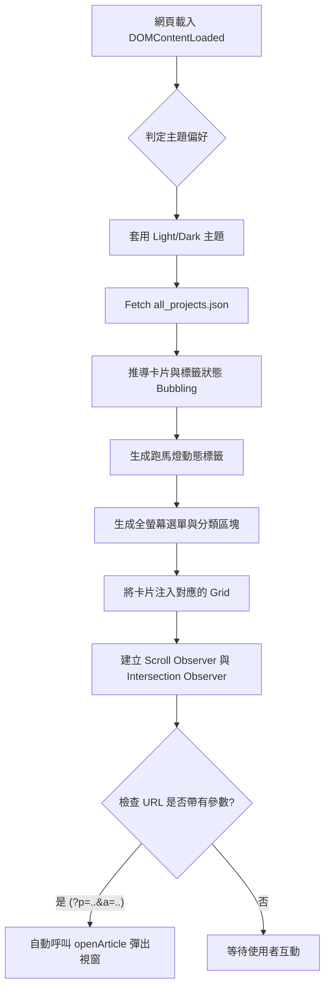
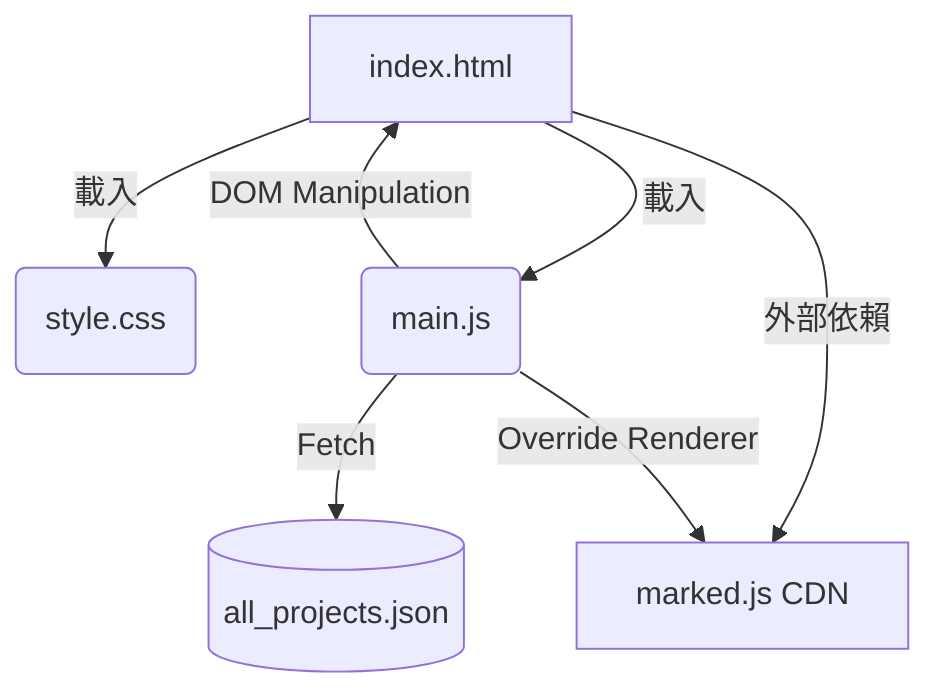

這是一份為您專案量身打造的完整新人交接指南。本指南基於您提供的 `index.html`、`style.css` 與 `main.js` 進行深度分析與整理，協助新進開發人員快速掌握專案全貌。

---

# 📦 風川梓 (Azustock) 作品集與技術部落格 - 交接與維護指南

> **閱讀對象**：本指南專為「從未接觸過此專案」的開發人員撰寫，旨在幫助您從整體架構到程式碼細節，快速掌握專案全貌並具備獨立維護能力。

## 1. 專案概述

### 1.1 專案用途

本專案為一個個人技術部落格與作品集展示網站。提供專案分類展示、標籤過濾（動態跑馬燈與卡片高亮）、以及無縫的單頁應用（SPA）Markdown 文章閱讀體驗。

### 1.2 系統架構

本專案採用 **純前端 (Vanilla Frontend) 架構**，不依賴後端伺服器與前端框架（如 React/Vue）。

* **核心技術**：HTML5 + CSS3 (大量使用 CSS 變數與高階選取器) + Vanilla JavaScript (ES6+)。
* **資料來源**：透過 Fetch API 動態載入靜態的 JSON 檔案 (`all_projects.json`) 作為資料庫。
* **Markdown 渲染**：引入第三方輕量級套件 `marked.js` 即時將 Markdown 轉換為 HTML。

### 1.3 執行流程

1. 使用者載入網頁，瀏覽器解析 HTML 與 CSS。
2. JS 啟動，優先判定使用者主題偏好（深色/淺色）並套用。
3. 發起非同步請求 (Fetch) 獲取 `all_projects.json`。
4. JS 根據 JSON 資料，動態生成全螢幕導覽列、跑馬燈標籤、以及專案卡片網格。
5. 監聽 URL 參數，若帶有特定文章的參數（`?p=...&a=...`），則自動彈出 Modal 顯示指定文章。

### 1.4 各模組之間的關係

* **`index.html` (骨架)**：定義了全站的基本 DOM 結構（導覽列、全螢幕選單、Modal 容器、Toast 提示框）。
* **`style.css` (外觀與物理引擎)**：不僅負責樣式，更透過 `transition`、`animation`、`will-change` 處理了全站 80% 的互動動畫（如 FLIP 動畫、Hover 特效、骨架屏）。
* **`main.js` (大腦)**：負責抓取資料、注入 DOM、監聽事件、URL 路由管理，以及處理 CSS 無法完成的複雜邏輯（如動態高度測量、捲軸定位）。

---

## 2. 專案目錄說明

| 檔案/資料夾名稱 | 檔案用途 | 核心模組 | 相依哪些模組 | 被哪些模組使用 |
| --- | --- | --- | --- | --- |
| `index.html` | 網站進入點，定義 DOM 容器結構 | 是 | `style.css`, `main.js`, `marked.js` | 無 (為最頂層) |
| `style.css` | 網站視覺樣式與 CSS 動畫引擎 | 是 | 無 | `index.html`, `main.js` (類別切換) |
| `main.js` | 核心邏輯、資料載入、DOM 動態生成 | 是 | `all_projects.json`, `marked.js` | `index.html` |
| `all_projects.json` | 存放專案與文章內容的資料庫檔案 | 是 | 無 | `main.js` |
| `assets/` | 存放靜態資源如圖片、Favicon 等 | 否 | 無 | `index.html`, `style.css`, `main.js` |

---

## 3. 各檔案詳細說明

### 📄 `style.css`

* **檔案概述**：極度依賴 CSS 變數 (`--var`) 驅動的主題系統。包含深淺色模式、網格排版、以及大量的微互動（Micro-interactions）。
* **維護重點**：
* **主題系統**：定義在 `[data-theme="dark"]` 與 `[data-theme="light"]`。新增顏色變數必須兩邊同步。
* **硬體加速**：關鍵動畫元素（如 Modal、圖釘、跑馬燈）皆使用了 `transform: translateZ(0)` 與 `will-change` 強制 GPU 渲染，修改時切勿移除，以免造成手機版卡頓。
* **動態模組化動畫**：定義了 `[data-modal-fx="..."]` 供模態框進退場使用。


### 📄 `main.js`

* **檔案概述**：全站的邏輯核心。包含設定檔區塊、資料抓取、UI 狀態管理與路由。
* **類別 (Class)**：本專案採用 Functional Programming 與全域變數狀態管理，**並未使用 ES6 Class**。

#### 核心全域設定 (`CONFIG`)

位於檔案最上方，任何發布前修改都在此進行。包含：`VERSION`, `DEFAULT_THEME`, `MARQUEE_SPEED`, `FAVICON_LIGHT/DARK`, `DATA_SOURCE`。

#### 核心函式說明 (Function)

**1. `window.getStatusBadgeHtml(item, isTitle)`**

* **功能**：根據資料的布林值（`is_new`, `is_updated`, 等）回傳對應的狀態標籤 HTML。
* **回傳值**：String (HTML 字串)
* **參數說明**：
* `item` (Object): 專案或文章的資料物件。必填。
* `isTitle` (Boolean): 是否為標題旁的標籤（決定是否加上 margin 類別）。預設 `false`。


**2. `window.handleImageError(img)`**

* **功能**：處理圖片載入失敗（破圖）。將其轉為 CSS 定義的骨架屏，並替換為 1x1 透明 SVG 以繞過 Safari 破圖圖示。
* **副作用**：修改 DOM 元素的 src 與 class。
* **參數說明**：
* `img` (HTMLElement): 發生錯誤的圖片元素本身 (`this`)。必填。


**3. `applyTheme(theme)`** (內部函式)

* **功能**：套用深/淺色主題，並切換對應的 Favicon 與 Giscus 留言板主題。
* **參數說明**：
* `theme` (String): `'light'` 或 `'dark'`。


**4. `loadProjects()`**

* **功能**：非同步載入 JSON，動態生成全螢幕選單、分類區塊、專案卡片，並初始化跑馬燈與 Scroll Observer。
* **呼叫時機**：`DOMContentLoaded` 觸發時。
* **副作用**：大幅修改 `index.html` 內的 DOM，綁定大量事件。涉及網路操作 (`fetch`)。

**5. `switchModalContent(updateDOMCallback)`**

* **功能**：處理 Modal 內部內容切換時的「高度自適應平滑拉伸動畫 (FLIP 技術)」。
* **副作用**：鎖定並解開 DOM 高度，操作過渡 class。
* **參數說明**：
* `updateDOMCallback` (Function): 執行實際 DOM 內容替換的回呼函式。必填。


**6. `window.openProjectIndex(projectId, restoreScroll)`**

* **功能**：開啟特定專案的「內容索引 (TOC)」選單。
* **呼叫來源**：點擊專案卡片、點擊「返回索引」按鈕。
* **副作用**：修改 Modal 內容，開啟 Modal，修改網址列 (URL Routing)。
* **參數說明**：
* `projectId` (String): 專案的唯一 ID。必填。
* `restoreScroll` (Boolean): 是否精準還原上一次捲動的位置。預設 `false`。


**7. `window.openArticle(projectId, articleIndex)`**

* **功能**：渲染並顯示特定 Markdown 文章，生成文章內部目錄與複製連結按鈕。
* **呼叫來源**：點擊「內容索引」中的文章連結、或從網址列參數自動解析啟動。
* **副作用**：呼叫 `marked.parse`，修改 Modal，修改網址列，暫存當前捲軸高度。
* **參數說明**：
* `projectId` (String): 專案的唯一 ID。必填。
* `articleIndex` (Number): 該文章在陣列中的索引值。必填。


**8. `window.filterByTag(targetTag, event, clickedElement)`**

* **功能**：過濾專案卡片。反白選中的標籤，高亮相關卡片，並讓跑馬燈平滑捲動到畫面中央。
* **參數說明**：
* `targetTag` (String): 要過濾的標籤名稱。必填。
* `event` (Event): 點擊事件，用於阻擋事件冒泡。必填。
* `clickedElement` (HTMLElement): 被點擊的 DOM 元素（用於判斷使用者從哪裡點擊）。選填。


**9. `window.closeModal()`**

* **功能**：關閉 Modal，恢復網頁背景捲動，並**清除網址列參數**（恢復乾淨網址）。

---

## 4. 執行流程

使用 Mermaid Flowchart 呈現系統初始化的生命週期：



---

## 8. 已知問題

* **已知 Bug (待確認)**：瀏覽器「上一頁/下一頁」按鈕。由於本系統使用 `history.replaceState` 改變網址而非 `pushState`，且未註冊 `popstate` 事件，若使用者依賴瀏覽器上一頁按鈕來「關閉」文章，可能不如預期。
* **特殊限制**：跑馬燈動畫為了達成無縫輪播且支援 Hover 暫停，混合了 CSS 動畫與 Web Animations API (WAAPI)。若大幅修改跑馬燈結構，需同步確認 JS 內的矩陣運算 (`DOMMatrix`) 是否計算正確。
* **容易踩雷的地方**：
* **動畫衝突**：`style.css` 中的 `jump-bump` 與 Hover 特效曾發生衝突。請注意 CSS 動畫中的 `transform` 屬性覆蓋問題。
* **字串拼接**：`main.js` 採用大量的 Template Literals (```) 組合 HTML，若引號或變數未妥善跳脫，極易發生語法錯誤 (例如之前的 SVG `onclick` 引號衝突事件)。


* **效能問題**：目前 Markdown 解析與 DOM 生成皆在主執行緒 (Main Thread) 進行。若 `all_projects.json` 資料量暴增（例如超過數百篇文章），`loadProjects` 迴圈可能會造成短暫的畫面卡頓。

---

## 9. 維護建議

* **新增功能應修改哪些地方**：
* **新增一種狀態標籤 (如 BUGFIX)**：需在 `main.js` 的 `STATUS_LIST` 陣列加入，並在 `style.css` 透過 `[data-status="BUGFIX"] { --s-color: ... }` 定義顏色。
* **新增網頁主題 (如 Cyberpunk)**：直接在 `style.css` 寫入 `[data-theme="cyberpunk"]` 變數覆寫，並於 `main.js` 新增對應切換邏輯。


* **哪些模組耦合較高**：
* `switchModalContent` 的邏輯極度依賴 `style.css` 中 `.content-fade-out` 類別的過渡時間 (目前設定為 `120ms` 左右)。若在 CSS 修改了動畫時間，JS 裡的 `setTimeout` 也必須跟著調整。


* **哪些地方不建議修改**：
* `main.js` 中關於跑馬燈 `marqueePlayer` 的 `DOMMatrix` 運算與 `animate` 動態生成區塊。此區塊解決了複雜的座標還原問題，牽一髮動全身。
* `style.css` 中的 `display: flow-root;` (消除浮動干擾) 以及 `-webkit-backface-visibility: hidden;` (消滅 3D 閃爍)。


* **可以改善的地方**：
* 使用 `document.createElement` 取代部分的 `innerHTML` 字串拼接，以提高安全性 (防範 XSS) 與程式碼可讀性。
* 引入 Router 系統攔截 `popstate` 事件，讓網址列的改變支援原生「上一頁」行為。


---

## 10. 快速索引

| 檔案 | 功能簡述 | 維護重點 |
| --- | --- | --- |
| `index.html` | 網頁進入點與基礎 DOM | 維護 `<head>` 區塊的 SEO/OG 標籤與外部資源引用 |
| `style.css` | 視覺、主題與動畫引擎 | 留意 CSS 變數覆寫與 GPU 硬體加速相關語法 (`will-change`) |
| `main.js` | 核心邏輯與動態渲染 | `loadProjects` 為資料載入核心，`openArticle` 負責內文渲染 |

---

## 11. 函式索引

| 函式名稱 | 所在檔案 | 核心功能 | 被誰呼叫 |
| --- | --- | --- | --- |
| `getStatusBadgeHtml` | `main.js` | 生成狀態標籤 HTML | `loadProjects`, `openProjectIndex`, `openArticle` |
| `handleImageError` | `main.js` | 處理破圖與佔位符號替換 | 圖片的 `onerror` 屬性 |
| `applyTheme` | `main.js` | 切換深淺色與 Favicon | `DOMContentLoaded`, 主題切換按鈕點擊 |
| `loadProjects` | `main.js` | 載入 JSON 並構建 DOM | `DOMContentLoaded` |
| `switchModalContent` | `main.js` | 執行 Modal 內容替換與平滑過渡 | `openProjectIndex`, `openArticle` |
| `openProjectIndex` | `main.js` | 開啟專案文章目錄 Modal | 點擊卡片、點擊「返回索引」按鈕 |
| `openArticle` | `main.js` | 渲染 Markdown 內文並加上複製按鈕 | `openProjectIndex` 內的連結、網址列解析 |
| `filterByTag` | `main.js` | 過濾卡片並讓跑馬燈對齊 | 點擊卡片標籤或跑馬燈標籤 |
| `scrollToNextCard` | `main.js` | 跳至下一張過濾中的卡片 | 點擊 Toast 的 Next 按鈕 |
| `clearFilter` | `main.js` | 清除全域標籤過濾狀態 | `filterByTag`, 點擊非標籤區, 打開專案 |

---

## 12. 模組依賴關係



---

*(若有任何未盡詳細之處，建議優先檢視 `main.js` 原始碼中的註解，該專案保留了非常多以 `✨` 標示的核心修改與修復說明。)*