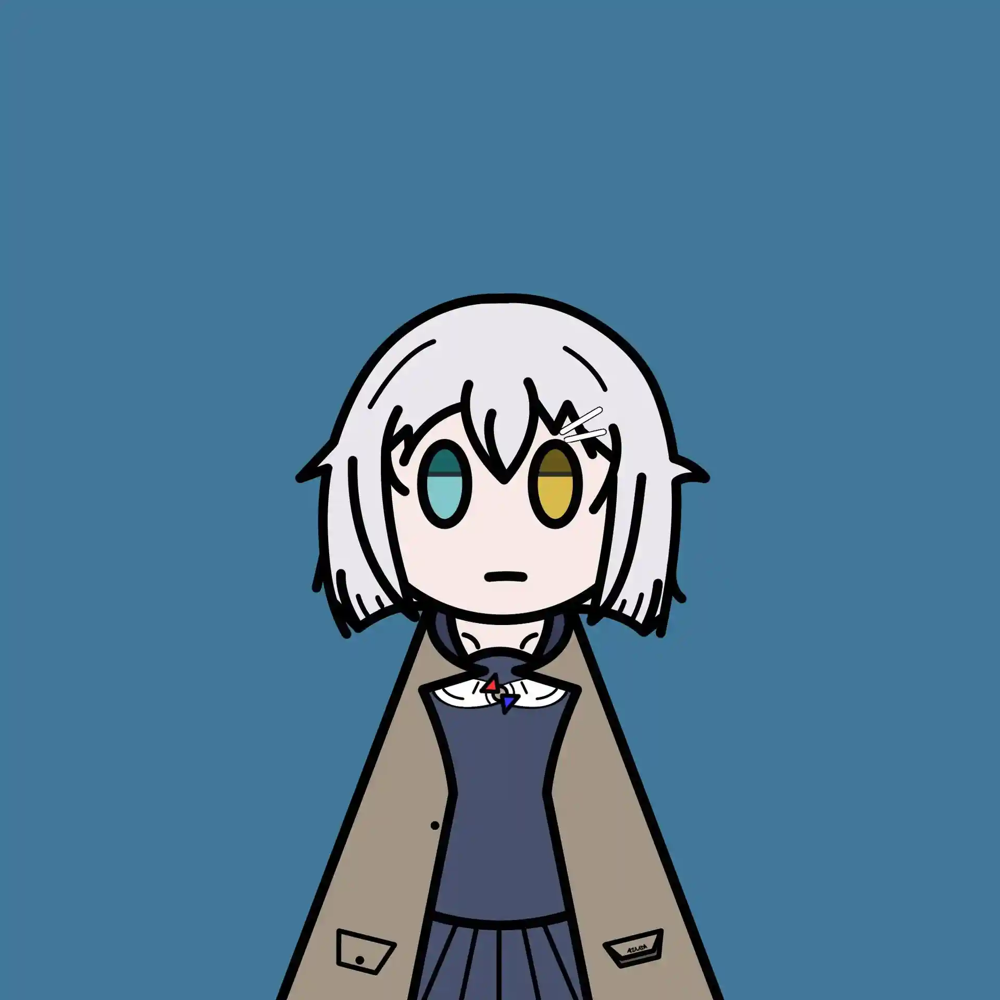
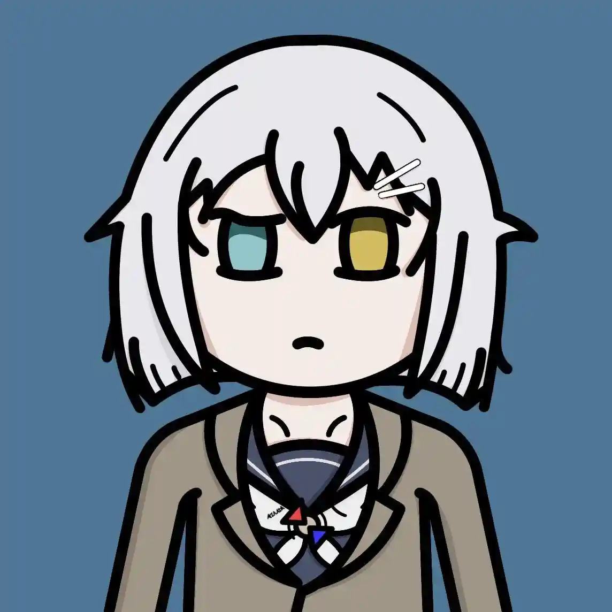
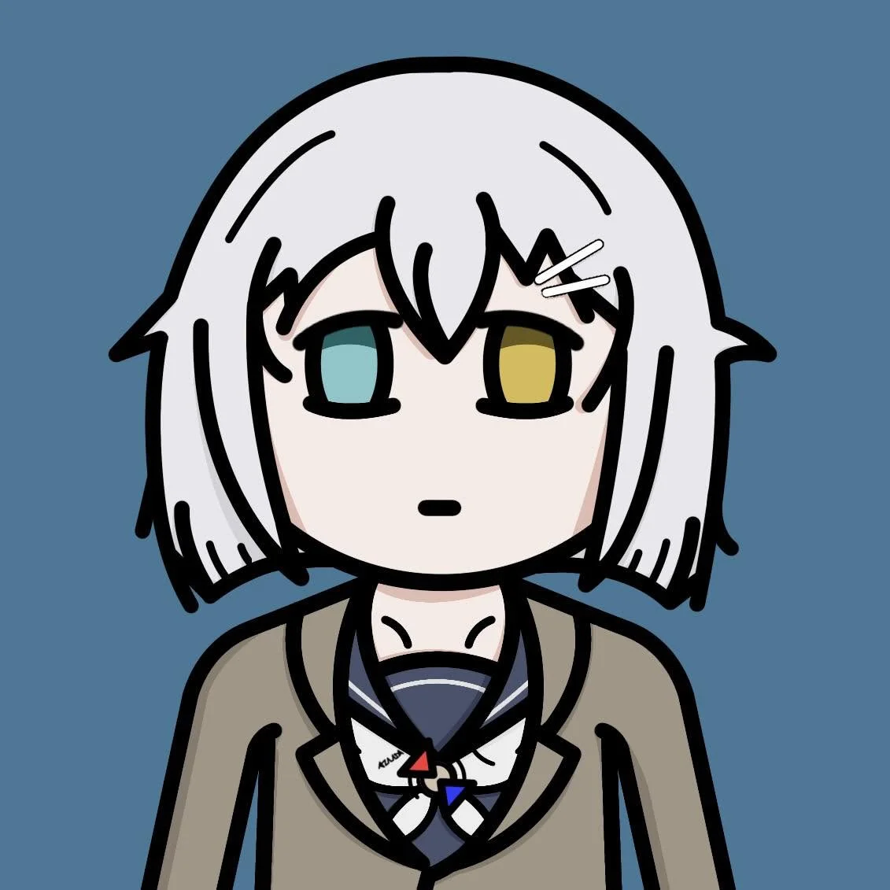

# 『梓川風』
<figure class="float-right">
  
  <figcaption>基礎方塊</figcaption>
</figure>

## 表情

  <figure><figcaption>困惑</figcaption></figure>
  <figure><figcaption>難過</figcaption></figure>

(coc7th | OC)  

Tag：  
作家、博士、偵探  

經歷：  
為了和編輯討論下一部作品而搭上了末班車，結果發生了不可思議的事情。  
不久後為了新作品的取材而參訪了神秘的研究機構，還沒開始工作就先睡了兩小時，醒來後… <—— 現在在這