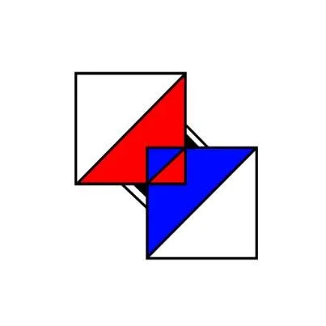

# <明天、今天和明天的今天>

## 「人一思考，上帝就笑了」
——————  
在被問到「妳的夢想是什麼」時，少女像是卡住一般的回不上話。她也許聽過未來要做什麼，但是那是她自己想的嗎?  

一個反應的完成，需要給予本不應存在的反應物以及環境。  
而在反應的當下，決定走向的是反應物還是那雙觀測的眼?  

少女得出了結論，那就是「虛無」，然而她卻被困在悖論裡走不出來，如果虛無是答案，為什麼她還有今天和明天；如果虛無不是答案，為什麼世界，乃至於她的世界都不須要她。  

——————  
缺乏勇氣的少女繼續著她的明天們，直到她那天頭暈、昏倒又撞到了頭，那瞬間，少女的白房中不再有灰絲。  
空無一物的白房不再為少女提供足夠的算力，而少女卻沒感到任何不適，只是在往後的日子裡，她沒有了明天，只有今天和明天的今天。  

因為傷勢，她再也不能進行思考；  
因為傷勢，她的人生只剩下今天。