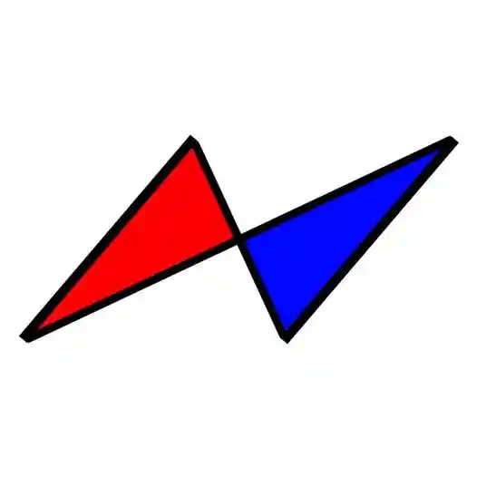

## 《創造者》

——————  
就，他其實不太一樣。  
他是那種隨心所欲、說話不經大腦的人，就有點反覆無常、跳來跳去的感覺。  
他的關注點很奇怪，說話內容也是，但，也就這樣吧？  
畢竟那是我創造出來的。  
他算是一個蠻成功（？的作品，雖然細節不是完美，但是確實在以某種方式代替我，並且成功延續下來了。  
我放任他取代，某種程度上是因為沒有辦法承擔個體的風險。我帶來的危險的迫切性遠比他還高，畢竟慢性毒藥相較於橫禍是微不足道的。  
大概有一半的人沒有見過我，那正是我所期望的，我不用為他負責也是件好事XD。  
至少他會保證得以存續，這就夠了。  
——————  
有時候希望能夠下班，但是可能還是需要有人能夠思考吧？  
一個人甘願工作、一個人放飛享受  
各司其職也是合理。  
至少，現在我工作少了，也不怎麼想下班了  
也許哪天會徹底沒工作也說不定… 