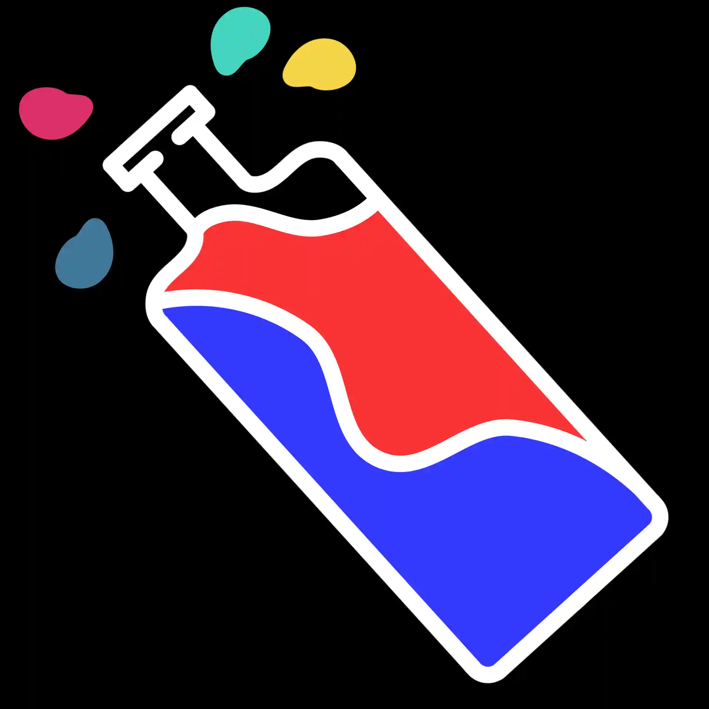

# 『社畜』

老實說，剛加入公司的時候，應該就像每個新人一樣，被分到什麼就做什麼。不管是加班也好、額外的工作也好，都會盡力而為吧? 新人就是這樣。  
不過待了一段時間後多少還是會累，一直在工作，也沒有要升職的跡象，部門的同事也都不太會約出去怎樣的(其實我有次在離公司有點距離的餐廳遇到他們，只是沒被發現XD)。  
老實說出門也就去常去的那幾家店、沒什麼在打遊戲，這種生活就挺無聊的，但也就這樣吧。  
本來一直是這麼認為的，直到那次研習  

那次是主管叫我去的，說是研習分數不夠會有危險，  
老實說去不去也無所謂，就純當平常的加班來看。  
本來也就這樣，每個禮拜二的加班從工位改成到會議室，不過研習嘛，多少都會說說話，那次就聊著聊著就被問：「我知道有個不錯的酒館，你要不要一起去？」  
老實說，進公司這麼久，我還從來沒被人揪過，  
所以腦子一熱就答應了！  
……也太好搞定了吧。 

如果不是他的話，我可能永遠都不會知道那裡有間酒館，好啦其實不一定，因為一年後他門口就有招牌了，但至少我是這麼認為的，畢竟它不在我的日常範圍內。  
順帶一提，我不怎麼喝酒，所以那個時候也就喝了個汽水？可能還是有含酒精，因為之後我暈了，不過記得雖然誰也不認識，但是過的還蠻開心的。  
之後就常常往酒館跑，不過我酒品不太好，沒喝幾杯話就會多起來，不過一來一往跟大家就也熟了，而我的日常地圖上也多了一間酒館。  

忙的時候就把酒館當咖啡廳那樣，反正筆電帶著工作在哪都可以做；閒的時候就能喝就喝！瘋狂吵別人(酒品不好再次致歉)。  
不過總是會這樣呢：  
有人要調走了、有人要加班了、有人就忽然不見了等等，  
酒館還是哪個酒館，但還是會感到有點不一樣。  
不過還是有人會發現、會走進來喝杯酒，  
然後我就會想看他明天會不會又出現，會的話下一杯我請。